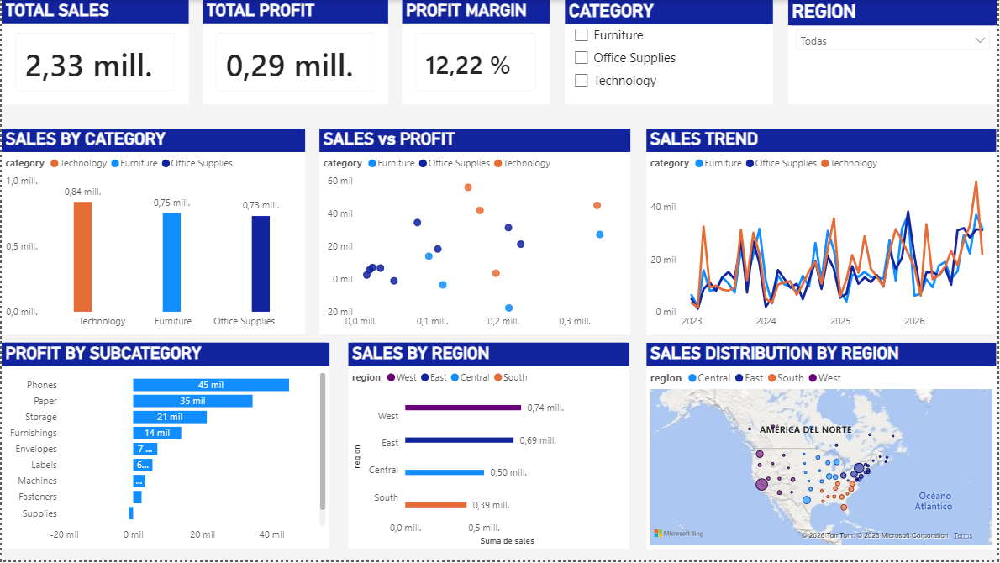

# Retail Sales Analysis

## Description

This project analyzes a retail sales dataset to evaluate business performance in terms of revenue, profitability, and behavior across categories, subcategories, and regions.

The analysis includes:

* Data exploration
* Dataset preparation
* Feature engineering
* Dashboard development in Power BI
* Insight generation based on observed data

---

## Dataset

The dataset contains retail transaction records with the following variables:

**Original variables:**

* order_date
* region
* category
* sub_category
* product_name
* sales
* quantity
* discount
* profit

**Derived variables:**

* year
* month
* month_name
* sales_per_unit
* profit_margin
* outliers_sales
* outliers_profit

The final dataset used for the dashboard is located at:

```text
data/processed/superstore_dashboard.csv
```

---

## Methodology

The project follows a structured data analysis workflow:

1. Initial data exploration
2. Data type validation
3. Feature engineering
4. Dataset preparation for analysis
5. Dashboard development in Power BI

---

## Dashboard

The dashboard was developed in Power BI and enables analysis of:

* Sales trends over time
* Sales by category
* Profit by subcategory
* Relationship between sales and profitability
* Regional performance

Dashboard preview:



Dashboard file:

```text
dashboard/retail_sales_dashboard.pbix
```

---

## Key Insights

* Technology is the category with the highest sales volume (~0.84M) and also the highest profit (~0.15M), outperforming Furniture (~0.75M in sales) and Office Supplies (~0.73M in sales), making it the primary driver of both revenue and profitability.

* For similar levels of sales, there are significant differences in profit, including cases with negative profit, indicating variability in profitability across subcategories.

* The West region shows the highest sales volume (~0.74M), while the South region has the lowest (~0.39M), highlighting a significant disparity in regional performance.

* Profit is concentrated in a small number of subcategories, led by Phones (~45K) and Paper (~35K), while several subcategories contribute significantly less, including Tables with negative profit (~ -18K).

---

## Project Structure

```text
retail_sales_analysis/

data/
    raw/
    processed/

notebooks/
    01_data_exploration.ipynb
    02_data_cleaning.ipynb

dashboard/
    retail_sales_dashboard.pbix

images/
    dashboard_overview.png

README.md
requirements.txt
.gitignore
```

---

## Tools Used

* Python (pandas, numpy)
* Jupyter Notebook
* Power BI

---

## Conclusion

The analysis highlights clear differences in performance across categories, regions, and subcategories, as well as variability in profitability at similar sales levels.

The dashboard provides a structured way to explore these patterns and serves as a foundation for further business analysis.
